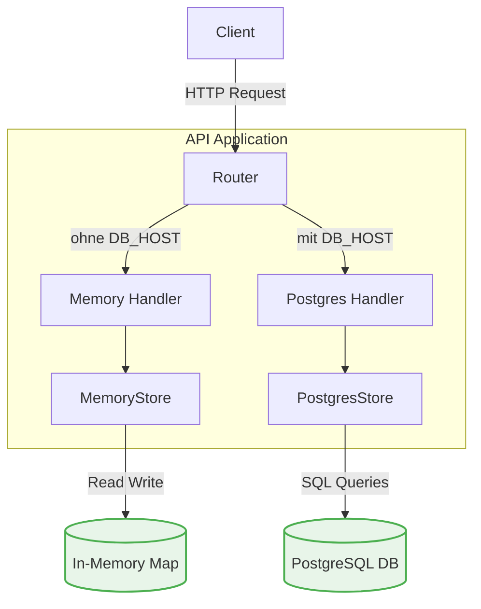

# Architektur-Dokumentation

## Request Flow (Anfrage-Ablauf)

Der Ablauf einer typischen HTTP-Anfrage in dieser Anwendung folgt einem klassischen Schichten-Modell. Die Anwendung entscheidet beim Start (in der `main.go`), ob der PostgreSQL-Store (wenn `DB_HOST` gesetzt ist) oder der In-Memory-Store verwendet wird.

### Erklärung der Komponenten:
1. **HTTP Request**: Ein Client sendet eine HTTP-Anfrage an die API.
2. **Router (`gorilla/mux`)**: In der `main.go` initialisiert. Er wertet die angefragte URL sowie die HTTP-Methode aus und leitet den Request an die zuständige Handler-Funktion weiter.
3. **Handler (`internal/handler`)**: Die Handler (`handler.go` oder `postgres_handler.go`) übernehmen die Verarbeitung der HTTP-Ebene. Sie lesen Parameter und Body aus, wandeln JSON in Go-Strukturen um (`model.Product`), rufen Validierungen auf und delegieren die Aufgabe an den passenden Store. Abschließend formatieren sie die HTTP-Response (JSON) und setzen die Status-Codes.
4. **Store (`internal/store`)**: Diese Schicht enthält die eigentliche Persistenz-Logik. Sie stellt Methoden wie `GetAll()`, `Create()`, etc. zur Verfügung. Der Store verbirgt die Komplexität der Datenspeicherung vor dem Handler.
5. **Database**: Das tatsächliche Speichermedium. Das ist entweder eine interne Go-Map im Arbeitsspeicher (inklusive Mutex-Locking) oder eine externe relationale Datenbank (PostgreSQL).

---

## Vergleich: MemoryStore vs. PostgresStore

### 1. MemoryStore (`internal/store/memory.go`)
Dieser Store hält die Produktdaten ausschließlich im lokalen Arbeitsspeicher (RAM) der laufenden Applikation in einer Go-Map. Lese- und Schreibzugriffe werden durch `sync.RWMutex` synchronisiert.

- **Wann verwenden?** 
  - Für erste Prototypen, lokale Entwicklungsphasen (wie in den ersten Übungen) und Unittests.
  - Wenn keine permanente Speicherung erforderlich ist (z. B. einfache Caches).
- **Trade-offs:**
  - *Vorteile*: Extrem schnell, da keine Netzwerk-Kommunikation und kein Disk-I/O erforderlich sind. Einfachstes Setup, da keine externe Datenbank (und kein Docker-Container dafür) benötigt wird.
  - *Nachteile*: Fehlende Persistenz (Daten sind nach App-Neustart weg). Nicht skalierbar: Wenn mehrere Instanzen der Anwendung gestartet werden, hat jede ihren eigenen, isolierten Datenbestand.

### 2. PostgresStore (`internal/store/postgres.go`)
Dieser Store nutzt eine echte, externe PostgreSQL-Datenbank und kommuniziert über Standard-SQL mit dem `github.com/lib/pq` Treiber. 

- **Wann verwenden?** 
  - In produktiven (oder produktionsnahen) Umgebungen, in denen Persistenz wichtig ist.
  - In verteilten Systemen und Cloud-Umgebungen, wo die Anwendung selbst "stateless" sein muss und über mehrere Container skaliert wird.
- **Trade-offs:**
  - *Vorteile*: Dauerhafte Speicherung der Daten (Persistenz). Horizontale Skalierbarkeit der Anwendung ist problemlos möglich, da alle Instanzen auf dieselbe Single Source of Truth zugreifen. Bietet ACID-Garantien (Konsistenz, Isolation).
  - *Nachteile*: Die Datenbank-Abfragen sind um ein Vielfaches langsamer als RAM-Zugriffe (Netzwerk-Overhead, I/O-Zeiten). Erfordert mehr Aufwand beim Setup, Betrieb und bei der Wartung der Infrastruktur (z. B. via Docker-Compose).
